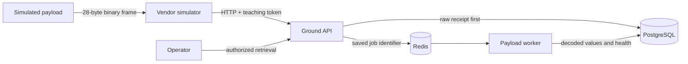

# Hiring Proof — Secure Payload Telemetry Gateway

## The engineering problem

A ground service should not treat incoming telemetry as trustworthy application data. It must preserve what arrived, verify the interface contract, reject corruption, prevent duplicate side effects, retain durable state, and make the result understandable to an operator.

This local project demonstrates that boundary with a fixed 28-byte binary frame and five services.

## Architecture



## What I implemented and verified

- A versioned binary packet contract with exact byte offsets and a golden vector.
- CRC-32 validation with specific rejection reasons.
- Raw-byte preservation before downstream processing.
- Persistent boot and sequence tracking for duplicates, gaps, and restarts.
- Idempotent processing so an exact repeated frame does not create second logical work.
- A queue containing durable identifiers rather than the only copy of telemetry.
- A separate worker that decodes engineering values and stores health classification.
- Typed FastAPI boundaries, PostgreSQL persistence, Redis work coordination, Docker Compose, health checks, metrics, and automated tests.
- A live proof covering nominal data, exact duplicates, and deliberately corrupted CRC data.

This is self-directed technical development. It is not represented as deployed customer software or flight software.

## Three-minute demonstration

```bash
make hiring-demo
```

The command starts an isolated Compose project on local ports 8180 and 8181, so it does not reuse or disturb another running development stack. It proves:

| Case | Expected evidence |
|---|---|
| Nominal frame | HTTP acceptance, exact raw-byte retrieval, `NOMINAL` processed result |
| Exact duplicate | Existing packet identity, `DUPLICATE`, no second logical processing job |
| Corrupted CRC | HTTP 422 and `CRC_MISMATCH` before worker processing |

The script stops services that it started. To leave them available for inspection:

```bash
HIRING_DEMO_KEEP_RUNNING=1 make hiring-demo
```

## Design decisions and tradeoffs

### Preserve before processing

The raw receipt is permanent evidence. Decoding or normalization can change later; the original bytes remain available for replay and investigation.

### PostgreSQL before Redis

Redis coordinates waiting work, but it is not the sole evidence store. A queue outage can delay processing without erasing the vendor delivery.

### Idempotency at the durable boundary

Retries are normal in distributed systems. Packet identity and durable state determine whether work already exists, rather than trusting an in-memory flag.

### Specific rejection reasons

`CRC_MISMATCH`, invalid length, unsupported version, invalid fields, and sequence conflict are distinct outcomes. Specific failure states make debugging and operator response safer than a generic “bad packet” error.

## Questions this project can answer in an interview

- Why preserve raw bytes before decoding?
- Why use PostgreSQL and Redis together?
- What does idempotency prevent?
- How do retries differ from duplicates?
- What happens if Redis or the worker is unavailable?
- How are sequence gaps and payload restarts represented?
- What is the difference between CRC integrity and authentication?
- Which controls are still missing before production deployment?

## Honest production gaps

- Local HTTP and static teaching tokens must be replaced with TLS, mutual TLS, certificate identity, rotation, and managed secrets.
- The current deployment is local Docker Compose, not a production orchestration platform.
- Dependency-outage and retry injection exist in tests and design work but require broader live fault campaigns before stronger reliability claims.
- Operational ownership, service-level objectives, backup/restore, migration policy, and security review would be required before production use.
